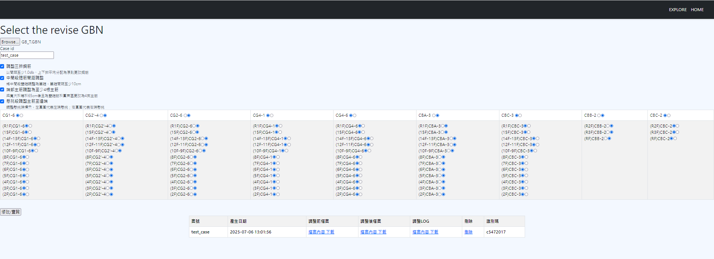
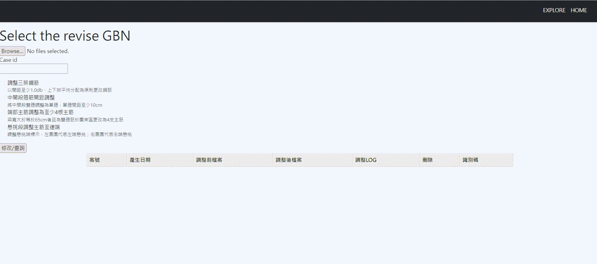
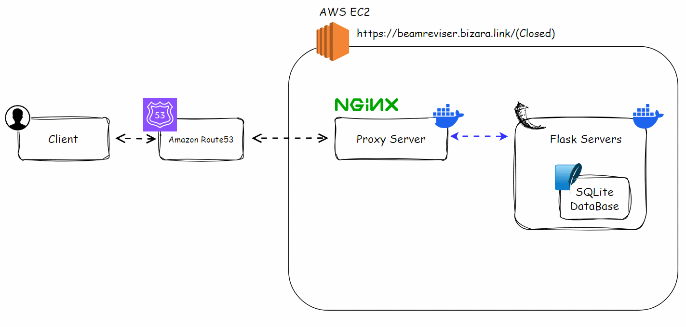

# Beam Revieser _-Productivity tool for structural beam design_

  </img>

## Features

### Revise Beam Info(/)
- **Revise:** Upload original beam data and revise it based on the latest design specifications. All changes are logged using Python’s logging module and stored in SQLite.

---

### Explore(/explore)

- **View Records:** Browse all revised beam entries with full design history.

  </img>

## Tech Stack

- **Beam Reviser:**
  - **Backend:** Flask
  - **Frontend:** Jinja2(HTML,CSS,Bootstrap,JavaScript)
  - **Database:** SQLite
- **Deploy and Environment:**
  - **Proxy Server:** Nginx
  - **Containerization:** Docker
  - **AWS Cloud Service:** EC2,S3,Route53

## Design Concept

### Architecture Design
- **Nginx Proxy:**  Reverse proxy to hide the specific addresses of backend containers, enhancing security and increasing flexibility.

  </img>

